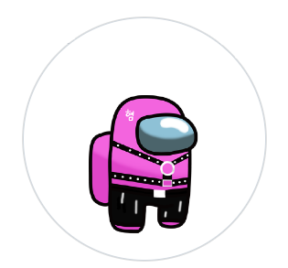
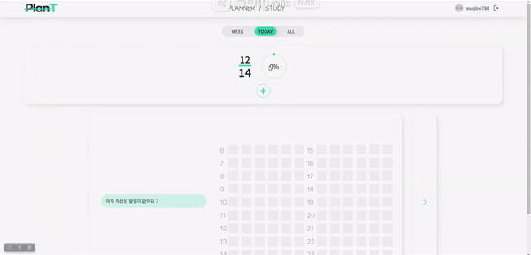
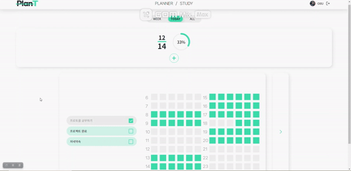
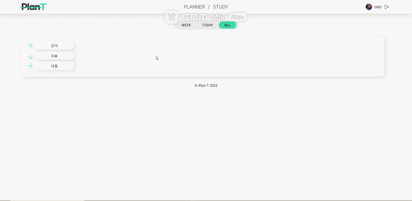
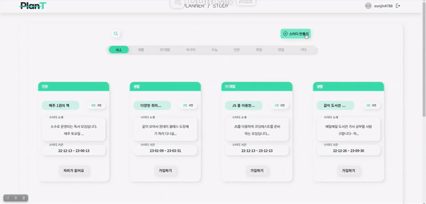
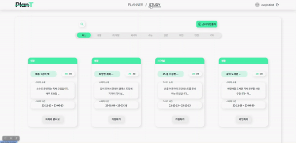
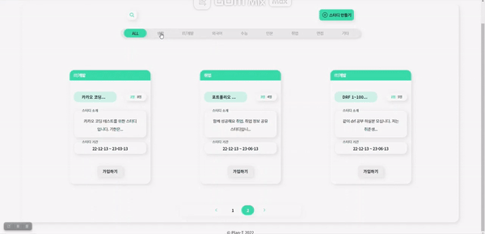
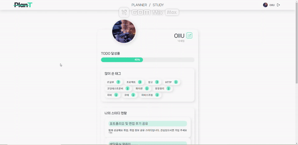
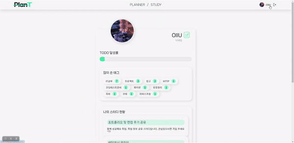
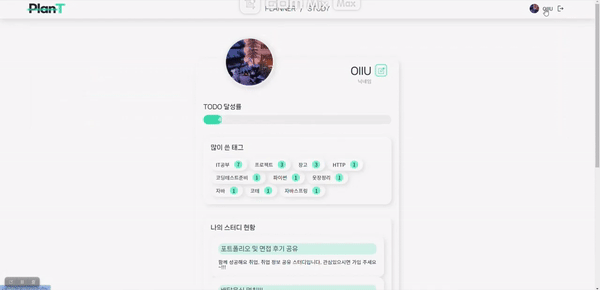

# 🌳 Plan T

---

> 사이트 바로가기
>
> Domain : [Plan T](http://plan-t.site/)
>
> 

 

## ✔ What is Plan T?

---

- Todo를 중점으로 한 개인 일정 관리 서비스와 스터디 커뮤니티를 통해 스터디 구성원들 간 공통 목표 Todo를 공유하는 웹 서비스

- 플랜을 짜다 의 Plan 과 식물의 Plant 를 합쳐 나를 키우는 계획이라는 뜻을 가지고 있다

- 프로젝트 기간 11.25 ~ 12.14
  
  | 구분       | 기간            | 활동              |
  |:--------:|:-------------:|:---------------:|
  | 프로젝트 기획  | 11.25 ~ 11.28 | 주제 선정 및 프로젝트 기획 |
  | 기본 기능 구현 | 11.29 ~ 12.13 | 기능 구현           |
  | 배포       | 12.14         | 배포              |
  | 문서 작성    | 12.13 ~ 12.14 | PPT , 기획서 정리    |
  | 프로젝트 발표  | 12.15         | 프로젝트 발표         |

 

## ✔ Plan T의 탄생 배경

---

- 사용해본 Todo 어플이나 스터디 어플 같은 경우에 개별적으로 일정을 관리해야 하기 때문에 일괄적으로 관리할 수 있는 서비스가 필요하다

- 기존의 플래너를 이용하지 않던 사용자의 유입을 위해서 필요한 기능들만 심플하게 구현한다

 

## ✔ 기술스택

* Version Control and Messenger

    

* Backend

   

* Frontend

    

* Infra

    

 

## ✔ 프로젝트 참여자

---

|                                                                             | 이름  | 팀   | 역할  | 깃허브 주소                         |
|:---------------------------------------------------------------------------:|:---:|:---:|:---:| ------------------------------ |
|  | 오채현 | 팀원  | 프론트 | https://github.com/chaehyun-oh |
|  | 류진숙 | 팀원  | 프론트 | https://github.com/wdahlia     |
|  | 이동근 | 팀원  | 백   | https://github.com/qlghwp123   |
|  | 이성인 | 팀원  | 백   | https://github.com/sungin95    |
|  | 이은진 | 팀원  | 백   | https://github.com/OIIUOI      |

 

## ✔ 주요 기능

---

### 목차

* User
  * 사용자 관리
  * 로그인 / 로그아웃
  * 회원가입 / 탈퇴
  * 프로필 – 마이페이지
* Todo
  * Todo 생성, 조회, 수정, 삭제 (CRUD)
  * Todo 상세 조회
  * 오늘 / 일주일 / 전체 기간별 Todo 조회
* Study
  * 스터디 그룹 생성, 조회, 수정, 삭제 (CRUD)
  * 스터디 공유 Todo 생성, 조회, 수정, 삭제 (CRUD)
  * 스터디 기간 설정
  * 스터디 인원 제한 설정
  * 스터디 커뮤니티 별 실시간 채팅

 

### Todo

* todo 생성

  

* todo 수정 및 삭제

  

* todo week 조회

  

* todo all 조회

  

 

### Study

* 스터디 생성

  

* 스터디 리스트 조회

  

* 스터디 가입 신청

  

* 스터디 가입 수락

  

* 스터디 채팅

  

 

### Accounts

* 알림 메세지

  

* 특정 태그의 todo list 조회

  

 

## 프로젝트 후기

- 오채현
  - 기획에서 생각했던 것처럼 간단하지 않아서 프로젝트 구현에 예상보다 시간이 오래 걸렸다.
  - 화면을 구성하는 것은 금방 끝났지만 js를 통한 이벤트 발생과 비동기에서 조금 어려움을 겪었었다.
  - 기간 내에 구현하기 위해 조금은 비효율적으로 작성한 코드들을 추후에 수정을 해서 프로젝트를 개선 시키고 싶다.
- 류진숙
  - 플래너를 만들어보고 싶다는 생각이 있었는데, 좋은 팀원들과 만들 수 있어서 행복한 시간이었다. 
  - 처음으로 DOM조작을 통해 자바스크립트 코드를 여러개 직접 작성해보고, 부트스트랩을 이용하지 않고 css로만 화면구성을 진행하였다는 점이 매우 뿌듯했다.
- 이성인
  - 버그 테스트의 중요성을 새삼 깨달았습니다. 기능이라는 것이 톱니바퀴와 같아서 서로 맞물리면서 잘 돌아가야 하는데요. 그런데 저는 톱니 바퀴만 만들고 나는 기능 개발 다 했어!!! 라고 했던 부분들이 꽤 있었습니다. 그리고 이 과정은 기능 개발 만큼이나 많은 생각을 해야 했습니다.
  - 코딩이라는 것이 나의 생각을 컴퓨터에게 전달하는 과정이고, 꽃을 피운다는 건 열매를 맺기 전에 가장 중요한 활동이라고 한다면, 버그 테스트야 말로 코딩의 꽃이 아닐까? 생각을 했습니다.
- 이은진
  - 많은 것들을 경험해보고 부딪혀보려고 했는데 생각만큼 잘 되지 않았어서 내가 좀 더 실력을 갖춘 사람이 되어야겠다고 다짐했고 공부도 스스로 많이 하고 토이프로젝트도 혼자서 만들어 봐야겠다고 생각했습니다
- 이동근
  - 플래너, todo, 다이어리와 같은 기록 관련 서비스는 전혀 사용해본 경험이 없어서 구현에 있어서 좀 헤맸지만, 좋은 경험이었다.

 
